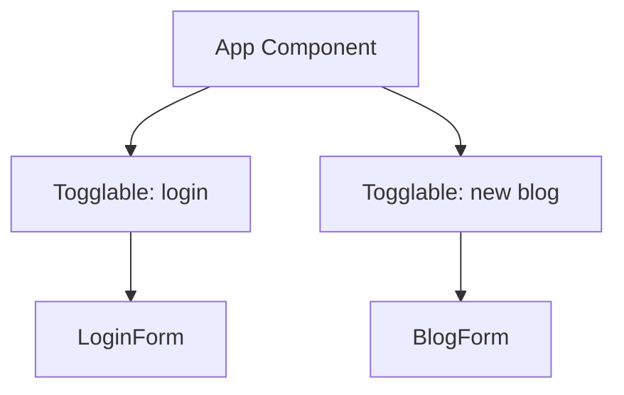

# 📘 **FullStackOpen – Part 5 Notes & Exercises**

## 🗺️ **Overview**
- **a Login in frontend**
  - **Main concepts:**
    - Conditional Rendering
    - Label elements
    - Local storage
- **b props.children and proptypes**
  - **Main concepts:**
    - Togglable React components
    - props.children
    - useREF hooks
- **c Testing React apps**
- **d End to end testing**

---

## ✅ **Exercises Checklist**

- [x] **Exercise 5.1:** Implement login functionality to the frontend
- [x] **Exercise 5.2:** Make the login 'permanent' by using the local storage. Also, implement a way to log out
- [x] **Exercise 5.3:** Expand application to allow the logged-in user to add new blogs
- [x] **Exercise 5.4:** Implement notifications that inform the user about successful and unsuccessful operations at the top of the page
- [x] **Exercise 5.5:** Change the creation form to be displayed only when appropriate
- [x] **Exercise 5.6:** Separate the creation form and all relevant states into its own component
- [x] **Exercise 5.7:** Add a button to each blog to control whether all of the details about the blog are shown or not
- [x] **Exercise 5.8:** Implement functionality for the like button.
- [x] **Exercise 5.9** Ensure when a blog is liked, the name of the user that added the blog is shown in the details
- [x] **Exercise 5.10** Sort the blog posts by the number of likes
- [x] **Exercise 5.11** Add the logic for deleting blog posts in the frontend
- [x] **Exercise 5.12** Add ESlint to the project and fix all the linter errors
- [x] **Exercise 5.13** Make a test to check that the component displaying a blog renders title and author but not URL or number of likes by default
- [x] **Exercise 5.14** Make a test to check that the URL and number of likes are shown when the button controlling the shown details have been clicked.
- [x] **Exercise 5.15** Make a test that ensures that if the like button is clicked twice, the event handler the component received as props is called twice
- [x] **Exercise 5.16** Make a test for the new blog form to check that the form calls the event handler it received as props with the right details when a new blog is created.

---

## 🧑‍💻 **Exercises Log & Notes**

**Exercise 5.1 - implement login functionality to the frontend**

**Concepts Learned**

- The user state stores elements such as the creation form or login details
- The label element improves the form's accessibility. This way, screen readers can read the field's name to the user when the input field is selected and clicking on the label's text automatically focuses on the correct input field.

**Implementation** 
```javascript
<div>
  <label>
    username
    <input
      type="text"
      value={username}
      onChange={({ target }) => setUsername(target.value)}
    />
  </label>
</div>
// ...
```

--- 

**Exercise 5.2: Make the login 'permanent' by using the local storage. Also, implement a way to log out**

**Concepts Learned** 

- We persist details of a logged-in user on the local storage. 
- The user details are saved to `user` state before being sent to blogService.

**Implementation**
```javascript
try {
  const user = await loginService.login({ username, password })
  window.localStorage.setItem(
    'loggedInUser', JSON.stringify(user)
  )
  blogService.setToken(user.token)
  setUser(user)
  setUsername('')
  setPassword('')
  showNotification(`Welcome ${user.name}!`, 'success')
} catch {
  showNotification('Wrong credentials', 'error')
}
```

---

**Exercise 5.3 - Expand application to allow the logged-in user to add new blogs**

**Concepts Learned**

- To ensure the frontend creation forms work with the backend, we must add the token of the logged-in user to the authorization header of the HTTP request.
- The `blogService` module contains a private variable called `token` which can be modified with the `setToken` function setting the token to the Authorization header.
- The event handler responsible for login must be changed to call the above method for a successful login.

**Implementation**
```javascript
const create = async newBlog => {
  const config = {
    headers: { Authorization: token }
  }

  const response = await axios.post(baseUrl, newBlog, config)
  return response.data
}
```

---

**Exercise 5.4 - Implement notifications that inform the user about successful and unsuccessful operations at the top of the page**

**Concepts Learned**

- Centralized notification logic improves user experience by providing immediate feedback for both successful and unsuccessful operations.
- By calling `showNotification` in event handlers (login, logout, blog creation), users are informed about the outcome of their actions without manual page refreshes.

**Implementation**
```javascript
const showNotification = (message, type = 'success') => {
  setNotification({ message, type })
  setTimeout(() => {
    setNotification({ message: null, type: null })
  }, 5000)
}
```
```jsx
<Notification message={notification.message} type={notification.type} />
```

---

**Exercise 5.5 - Change the creation form to be displayed only when appropriate**

**Concepts Learned**
- Components are reusable javascript functions that return `jsx` markdown
- States and functions can be passed down from parent components to children components
- To reuse the `ToggleForm` component the code has assumed a tree structure from the parent `App` component i.e



**Implementation**
```javascript
//...
const App = () => {
//..
 return (
      <div>
        //...
          <ToggleForm buttonLabel="Log in to application">
            <LoginForm
              username={username}
              password={password}
              handleUsernameChange={({ target }) => setUsername(target.value)}
              handlePasswordChange={({ target }) => setPassword(target.value)}
              handleLogin={handleLogin}
            />
          </ToggleForm>
      </div>
    )
}
export default App
```

---

**Exercise 5.6 - Separate the creation form and all relevant states into its own component**

**Concepts Learned**
- Localize state: Start with state as close to where it’s used as possible.
  - BlogForm inputs → local to `BlogForm`.
- Lift state up: Only move it higher when you discover multiple components need it i.e.
  - To ensure the state of two components always change together, remove the state from both components to their closest common parent, and pass it down via props.

---

**Exercise 5.7 - Add a button to each blog to control whether all of the details about the blog are shown or not**

**Concepts Learned**
- div elements are block thus will begin in a new line in the browser
- Toggling algorithm can be implemented using states

**implementation**
```javascript
<div>
  {!visible && (
    <div>
      {/* Stuff that will show after clicking hide */} 
      <button onClick={() => setVisible(true)}>view</button>
    </div> 
  )} 
  {visible && (
    <div>
      {/* Stuff that will show after clicking view */} 
      <button onClick={() => setVisible(false)}>hide</button>
    </div>
  )}
</div>
```

---

**Exercise 5.8 - Implement functionality for the like button.**

**Concepts Learned**
- The backend supports updating via `PUT /api/blogs/:id` with `{ likes: newLikes }` in the request body
- To update using `HTTP PUT`, the whole blog must be replaced with only the required change i.e, like + 1

**Implementation**
```javascript
const handleLike = async () => {
  const updatedBlog = { ...blog, likes: likes + 1 }
  const returnedBlog = await blogService.update(blog.id, updatedBlog)
  setLikes(returnedBlog.likes)
}
```

---

**Exercise 5.10 - Sort the blog posts by the number of likes**

**Concepts Learned**
- One can chain a `sort` function with `map` function declarations
- `.slice()` creates a shallow copy so you don’t mutate the original blogs array.
- `.sort((a, b) => b.likes - a.likes)` sorts blogs in descending order by likes.

**Implementation**
```javascript
{blogs
  .slice() // create a copy to avoid mutating state
  .sort((a, b) => b.likes - a.likes)
  .map(blog =>
    <Blog key={blog.id} blog={blog} user={user} />
  )
}
```

---

**Exercise 5.11 - Add the logic for deleting blog posts in the frontend**

**Concepts Learned**
- To ensure logged-in user is creator of the blog, we can chain && operands
- The delete function will also use the filter function

**Implementation**
```javascript
// Check if the logged-in user is the creator of the blog
  const isOwner = blog.user && user && blog.user.username === user.username

//App.jsx implementation
const handleDeleteBlog = (id) => {
  setBlogs(blogs.filter(blog => blog.id !== id))
  showNotification('Blog deleted!', 'success')
}
```

---

**Exercise 5.13 - Make a test to check that the component displaying a blog renders title and author but not URL or number of likes by default**

**Concepts Learned**
- `toBeDefined()` just checks the variable is not undefined. If `getByText` doesn't throw the tested element will always be defined. It is a weak assertion.
- `toBeInTheDocument()` explicitly asserts that the DOM element exists in the document body of the rendered output
- `getByText` trims leading/trailing spaces, but if there are weird non-breaking spaces or line breaks, the exact match may fail.
- regex matchers are essential in handling exact match fails of `getByText`

**Implementation**
```javascript
// works even if text is split or has extra spaces
screen.getByText(/myTestTitle/)
```

---

**Exercise 5.16 - Make a test for the new blog form to check that the form calls the event handler it received as props with the right details when a new blog is created.**

**Concepts Learned**
- Using `vi.fn()` or `jest.fn()` creates mock event handlers for testing
- Using mock objects, we test that form fields controlled by React state are called correctly
- Using methods such as `toHaveBeenCalledWith` and `toHaveBeenCalledTimes` we can check both the number of times the handler is called and the exact arguments it receives.

**Implementation**
```javascript
expect(handleCreateBlog).toHaveBeenCalledTimes(1)
    
// Assert that handleCreateBlog is called with title, author, and url details
expect(handleCreateBlog).toHaveBeenCalledWith({
    title: 'myTestTitle',
    author: 'myTestAuthor',
    url: 'myTestUrl'
})
```